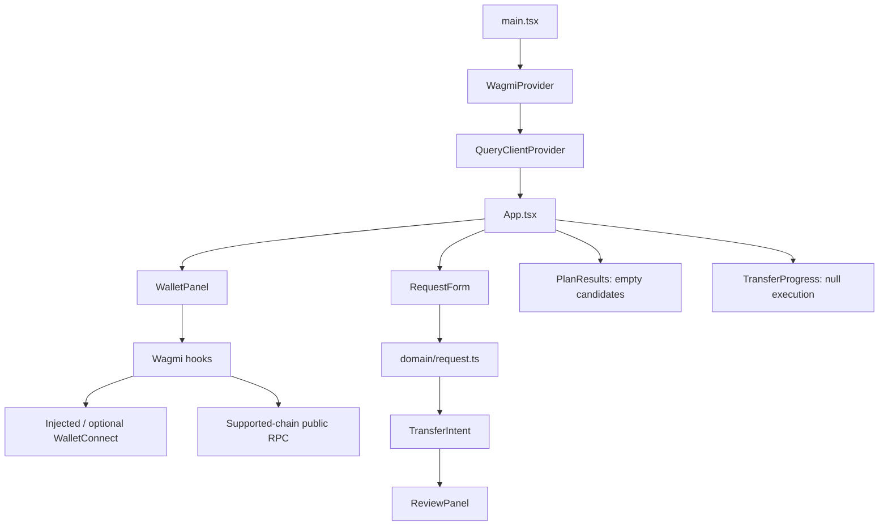
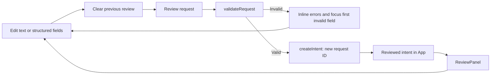

# Frontend milestone: analysis and file structure

This document describes the implemented frontend for the master's thesis project **AI agent-based blockchain interoperability router**. The application uses the working name **Relay**.

The analysis is based on the source files in this repository. It separates implemented behavior from proposed future architecture. Passing checks reported below refer to the implementation session; they are not claims of a production audit or live SDK execution.

## 1. Purpose and milestone boundary

The eventual system should accept a natural-language cross-chain task, inspect wallet and chain information, obtain routes from several providers, compare those routes against user constraints, explain the result, request approval, and monitor execution.

The first frontend milestone establishes the user-facing workflow and data contracts needed for that system. It implements wallet connection and native balance reading, but stops at request review.

| Capability | Current implementation | Remaining work |
| --- | --- | --- |
| Browser wallet | Injected EVM connection through Wagmi | Manual testing with actual wallet extensions |
| WalletConnect | Optional connector and Ethereum provider dependency | User project ID and real mobile-wallet pairing |
| Account information | Address, connector, chain, connection state | Broader wallet/network compatibility testing |
| Native balance | Current supported testnet's ETH balance | Other networks, ERC-20 balances and portfolio inspection |
| Natural-language task | Editable text preserved with the request | Agent interpretation and clarification |
| Structured request | Manual fields, validation and exact review | Supported chain/token discovery and verified metadata |
| Route planning | TypeScript interface and empty results area | Backend planner and provider adapters |
| Route comparison | Candidate renderer with output, fees, gas and representation | Constraint evaluation, ranking and selection |
| Polkadot wallet | Separate ecosystem represented in types | Substrate wallet adapter and signer |
| Signing and transfers | No signing controls or execution implementation | Validated quotes, explicit approval and execution service |
| Progress tracking | Typed status renderer, currently empty | Real receipts and destination monitoring |

The result is a frontend milestone, not a completed interoperability router. A reviewed request does not prove that a route exists or that the user can execute it.

## 2. Repository and technology decisions

The workspace was empty when implementation began. There was no existing frontend, package manager configuration, or applicable `AGENTS.md` instruction file. A standalone application was created in `frontend/` using npm.

| Technology | Role in this implementation |
| --- | --- |
| React and React DOM | Components, local form state and rendering |
| TypeScript | Domain contracts and compile-time checks |
| Vite | Local development server and production bundling |
| Wagmi | Reactive EVM connection, disconnect, network switching and balance hooks |
| Viem | Maintained chain definitions, EVM address validation and precise balance formatting |
| TanStack React Query | Query lifecycle, caching and balance refetching |
| `@wagmi/connectors` | Injected and WalletConnect connector implementations |
| `@walletconnect/ethereum-provider` | Required provider dependency for WalletConnect |
| Vitest | Unit tests for request validation and intent creation |
| Playwright | Browser interaction, responsive layout and simulated wallet tests |

Versions are declared in [frontend/package.json](frontend/package.json). [frontend/package-lock.json](frontend/package-lock.json) records the resolved dependency graph. Use `npm ci` to reproduce that graph instead of resolving a new installation from version ranges.

The architecture deliberately uses a small number of components and interfaces. A global state library, backend framework, SDK abstraction framework, and LLM client are unnecessary for the implemented request-review workflow.

## 3. File structure

The following tree lists maintained application files. Generated dependencies and build/test output are shown separately.

```text
code/
├── .gitignore
├── FRONTEND_ANALYSIS.md
└── frontend/
    ├── .env.example
    ├── README.md
    ├── index.html
    ├── package.json
    ├── package-lock.json
    ├── tsconfig.json
    ├── vite.config.ts
    ├── playwright.config.ts
    ├── e2e/
    │   └── workflow.spec.ts
    └── src/
        ├── main.tsx
        ├── App.tsx
        ├── styles.css
        ├── components/
        │   ├── RequestForm.tsx
        │   ├── ReviewPanel.tsx
        │   ├── PlanResults.tsx
        │   └── TransferProgress.tsx
        ├── domain/
        │   ├── types.ts
        │   ├── chains.ts
        │   ├── request.ts
        │   └── request.test.ts
        ├── integrations/
        │   └── planner.ts
        └── wallet/
            ├── config.ts
            └── WalletPanel.tsx
```

| File | Responsibility |
| --- | --- |
| `.gitignore` | Excludes dependencies, builds, local environment files and test reports |
| `frontend/.env.example` | Documents the optional public WalletConnect project ID |
| `frontend/README.md` | Setup, commands, milestone scope, manual checks and next integration points |
| `frontend/index.html` | HTML entry page and root element |
| `frontend/package.json` | Application dependencies and npm commands |
| `frontend/package-lock.json` | Resolved dependencies for reproducible installation |
| `frontend/tsconfig.json` | Strict TypeScript configuration for application source and Vite configuration |
| `frontend/vite.config.ts` | Vite configuration with the React plugin |
| `frontend/playwright.config.ts` | Browser test location, Edge channel and managed development server |
| `frontend/src/main.tsx` | Creates the React root, Wagmi provider and React Query provider |
| `frontend/src/App.tsx` | Composes the page and owns the reviewed request snapshot |
| `frontend/src/styles.css` | Visual design, layout, responsive rules, focus states and reduced-motion styling |
| `frontend/src/components/RequestForm.tsx` | Editable fields, inline errors and review submission |
| `frontend/src/components/ReviewPanel.tsx` | Displays the reviewed intent without treating it as approval |
| `frontend/src/components/PlanResults.tsx` | Empty planning state and reusable candidate cards |
| `frontend/src/components/TransferProgress.tsx` | Empty execution state and status/transaction rendering |
| `frontend/src/domain/types.ts` | Shared domain types independent of React and provider SDKs |
| `frontend/src/domain/chains.ts` | Supported chain definitions, native asset construction and display identity |
| `frontend/src/domain/request.ts` | Form field model, defaults, validation and intent creation |
| `frontend/src/domain/request.test.ts` | Unit tests for precision, asset identity, addresses and constraints |
| `frontend/src/integrations/planner.ts` | Future planning service and provider adapter contracts |
| `frontend/src/wallet/config.ts` | Chains, connectors, public RPC transports and optional WalletConnect registration |
| `frontend/src/wallet/WalletPanel.tsx` | Wallet UI and EVM session projection through `useWalletSession` |
| `frontend/e2e/workflow.spec.ts` | Form/review tests and test-only EIP-1193/RPC simulations |

Generated directories are `frontend/node_modules/`, `frontend/dist/` and `frontend/test-results/`. They are not application source. `frontend/.env` is local configuration created by the user; it is not included as a committed credential file.

## 4. Current architecture



`main.tsx` establishes the provider context. `App.tsx` coordinates presentation and the reviewed intent, while the form manages editable values and errors locally. Wallet connection state comes from Wagmi; the application does not maintain a second independent connection state machine.

The domain layer contains plain TypeScript definitions and request logic. It has no dependency on React or the eventual ParaSpell, LI.FI or Wormhole SDKs. This allows future backend clients and provider adapters to exchange the same domain objects without embedding SDK-specific structures in the form.

`PlanningService` is currently a contract only. Its exported instance is `null`, and the application does not call a planner. `App.tsx` supplies an empty candidate array and a null execution record explicitly.

## 5. Wallet connection and balance flow

### 5.1 Supported networks

| Network | Chain ID | Native balance unit | Definition source |
| --- | --- | --- | --- |
| Base Sepolia | 84532 | ETH | `viem/chains` |
| Arbitrum Sepolia | 421614 | ETH | `viem/chains` |

The wallet configuration uses public HTTP transports from the maintained chain definitions. The configured transport timeout is 12 seconds. Multicall batching is disabled so native balance reads use `eth_getBalance` directly.

These networks demonstrate connection and reading only. No route availability is assumed between them. The natural-language placeholder mentions mainnet-style Base/Arbitrum USDC as an example of the eventual task language; the form and page explicitly identify the current configuration as testnets.

### 5.2 Connector registration

The injected connector is always registered. WalletConnect is registered only when `VITE_WALLETCONNECT_PROJECT_ID` contains a nonempty value. The connector uses a QR modal and application metadata with the current browser origin.

This conditional configuration lets the app start without a Reown project. A missing project ID produces explanatory text rather than a nonfunctional WalletConnect button. A configured ID does not by itself prove that pairing will succeed; project settings, wallet support and connectivity still matter.

### 5.3 Visible wallet states

The panel displays `disconnected`, `connecting`, `reconnecting` or `connected` from Wagmi. Once connected, it displays the full address, connector name, and current chain. It offers network switching and disconnect actions.

Account and chain changes are observed through the connection hook. A previous-value reference detects changes and produces a visible status message. Form fields remain manually chosen; changing a wallet account or network does not silently alter the recipient, request source chain or destination chain.

### 5.4 Balance lifecycle

The balance query is enabled only when the connection is established and the current wallet chain is supported. Its key follows the account and chain supplied to the hook. The interface shows loading, an observed value with unit, or an error.

The returned integer value is formatted using `formatUnits`; it is not converted through a JavaScript floating-point number. The balance refreshes every 20 seconds and can also be refreshed manually. React Query is configured with one query retry; transport behavior is handled separately by the HTTP transport.

An unsupported chain keeps the connection visible but suppresses balance reading and explains how to switch to a supported testnet. A failed read displays an error instead of substituting a numeric balance.

The displayed balance is an observation obtained through a public RPC endpoint. It is not a reserved amount, a spendability check, a transfer estimate or proof that bridge fees can be paid.

## 6. Request creation and review



The original natural-language string is stored without parsing. The structured controls are the authoritative input for this milestone. If the text says “send 2 USDC” and the fields specify `0.1 ETH`, the review displays `0.1 ETH` and preserves the original text separately. It does not claim to resolve that discrepancy.

After a successful validation, `createIntent` assigns a UUID and constructs chain-qualified source and destination assets. Leading/trailing whitespace is trimmed from amounts, addresses and structured metadata; natural-language text is preserved as entered. Blank optional constraints become `undefined`, while an explicit `0` remains a supplied constraint.

The review contains the source amount and token, source and destination identity, decimals, recipient, fee limit, minimum received amount, wrapped-token preference and original text. It is moved into keyboard focus after successful submission.

Any form edit clears the reviewed snapshot, including edits to natural-language text and the wrapped-token checkbox. The review is in React memory and is lost on page reload. It is not submitted to a backend or persisted as a transfer record.

Wallet changes currently do **not** clear the request review. This is acceptable while review is only a record of manually entered intent. Future quotes and execution approvals must be invalidated or revalidated against wallet changes independently.

## 7. Validation rules and their limits

| Field | Enforced rule |
| --- | --- |
| Source/destination chain | Must be one of the configured testnets |
| Cross-chain pairing | Source and destination must differ |
| ERC-20 contract | Valid EVM address according to Viem; zero address rejected |
| ERC-20 display symbol | Required when a custom token is selected |
| ERC-20 decimals | Integer between 0 and 255 |
| Source amount | Decimal string greater than zero; limited to source token precision |
| Recipient | Valid, nonzero EVM address |
| Maximum fee | Optional nonnegative USD decimal with at most two fractional digits |
| Minimum received | Optional nonnegative decimal within destination token precision |
| Natural-language task | Optional text, retained without inference |
| Wrapped-token acceptance | Explicit boolean, initially false |

The amount validator rejects exponent notation, negative numbers, zero source amounts and excess fractional precision. It also rejects incomplete decimal formats such as `.5` and `1.`; the accepted equivalents are `0.5` and `1.0`.

Native precision is currently assumed to be 18 by the request validator, matching both configured ETH testnets. If a future supported native asset uses a different precision, this logic should obtain decimals from the chain definition instead of preserving that assumption.

Client validation does not verify deployed contract code, ERC-20 conformance, token metadata, balances, allowances, bridge support, recipient ownership or route liquidity. A syntactically valid contract address can still be an unusable asset. User-supplied decimals and symbols must be checked before quote generation and execution.

The minimum output and fee fields record requirements; they do not enforce constraints against real candidates yet. In particular, a wrapped alternative requires a defined relationship to the preferred destination asset before its output can be compared with the requested minimum.

## 8. Domain model analysis

| Type | Purpose | Design implication |
| --- | --- | --- |
| `ChainRef` | EVM chain ID or Substrate genesis hash/name | Makes the ecosystem explicit |
| `AssetId` | Native EVM, ERC-20 or Substrate asset identity | Symbols remain display metadata rather than unique identifiers |
| `WalletSession` | Ecosystem-specific address, network, connector/adapter and state | An EVM session cannot be presented as a Substrate signer |
| `AssetAmount` | Asset identity plus decimal amount string | Retains token units and precision without floating-point conversion |
| `TransferIntent` | Reviewed manual request and constraints | Independent of a particular SDK or route |
| `FeeItem` | Fee amount/token, label, input inclusion and optional USD estimate | Supports different fee tokens and avoids implicit unit assumptions |
| `RouteCandidate` | Provider, exact assets/input/output, representation, fees, gas, quote timing, warnings and steps | Allows several providers to return comparable descriptions |
| `TransferStatus` | Approval, source submission, progress, completion and failure labels | Provides a presentation vocabulary for later execution |
| `TransferExecution` | Candidate ID, status, observed transactions, update time and optional error | Separates observed execution records from quote estimates |

An EVM native asset is identified by its chain and native kind. An ERC-20 is identified by its chain and contract address. A Substrate asset carries a chain reference and chain-appropriate identifier. The Substrate identifier format still needs to be made precise for the chains and ParaSpell APIs selected later.

`RouteCandidate` carries both asset fields and amount-bearing asset objects. A future runtime validator should enforce their consistency, such as equality between `sourceAsset` and `sourceInput.asset`. TypeScript alone cannot establish these semantic relationships or validate JSON received from a service.

Quote times and expiry are strings without a runtime date check. `expiresAt` is optional because providers may not supply it. Missing expiry must not be interpreted as indefinite validity; define a quote freshness policy and revalidation step.

`totalUserCostUsd` is optional and its accounting policy is not implemented. Before comparisons are introduced, define whether this term means fees and gas alone or includes transferred principal. The form's maximum fee should apply to the total fee burden, using explicit valuations and no double counting of fees already included in input.

The transfer status union describes labels, not an enforced state machine. It does not yet reject invalid transitions, establish confirmation thresholds, handle reorgs or model retries. Those responsibilities belong to a future execution service.

## 9. Future agent and planning architecture

The existing planning contract is:

```typescript
plan(
  intent: TransferIntent,
  wallets: WalletSession[],
  signal?: AbortSignal,
): Promise<RouteCandidate[]>
```

The existing provider adapter contract is:

```typescript
quote(intent: TransferIntent, signal?: AbortSignal): Promise<RouteCandidate[]>
```

These interfaces are sufficient to begin the next milestone without restructuring the request form. They are not full backend protocols: error formats, partial provider failures, authentication, streaming, pagination and validation policy remain undefined.

A proposed future division of responsibility is:

| Layer | Responsibility |
| --- | --- |
| Frontend | Gather intent, show questions, explain candidate differences and collect explicit approval |
| Agent service | Interpret natural language, detect ambiguity and request user clarification |
| Planning module | Read verified chain/wallet data, gather candidates, enforce constraints and rank feasible plans |
| Provider adapters | Call ParaSpell, LI.FI or Wormhole and normalize provider results |
| Execution service | Revalidate approved quotes, request the appropriate signer and monitor execution |

LLM interpretation should propose structured values for confirmation rather than silently changing an already reviewed request. The original text should remain available for explanation and auditing.

Provider adapters must preserve provider provenance and exact token identities. Existing route selection inside an SDK does not remove the need to compare providers under the same recipient, output requirements and fee policy.

This milestone does not demonstrate LI.FI execution on testnets. The original project requirement identifies LI.FI testnet transfers as unsupported; validate network support again when beginning the SDK milestone. Wormhole and ParaSpell also require their own network-specific integration and testing.

## 10. Transaction approval boundary

There are currently no signing functions, transaction buttons, approval requests or execution calls. Wallet connection establishes an account/session; it is not transfer consent.

Before adding signing, implement a separate approval view for a concrete quote. It should bind approval to the quote, recipient, exact input/output assets, expected and minimum output, maximum costs, wallet account and chain, steps, warnings, and freshness policy.

Immediately before execution, recheck quote validity, provider parameters, wallet identity, source network, token metadata, funds, gas needs and applicable allowance requirements. Any materially changed terms should require a new approval.

Execution must use the correct ecosystem signer. An EVM WalletConnect connection cannot authorize ParaSpell operations that require a Substrate signer. A future Substrate adapter needs separate account selection, permissions, network identity and signature handling.

Source submission is only one stage. Destination completion should be established from destination-side evidence or a defined provider verification mechanism, rather than inferred from a submitted source hash.

## 11. User experience and accessibility

The interface is organized as a financial workflow: wallet context, task description, structured transfer details, constraints, review, candidates and progress. It uses plain-language descriptions alongside exact addresses and units.

Implemented accessibility features include associated form labels, semantic controls, visible focus styles, invalid-field attributes, contextual help, status/error announcements and focusing the first invalid field. Review receives focus after successful submission. The CSS includes reduced-motion handling and readable wrapping of long identities in review/output areas.

The layout uses two columns on larger screens and a single-column workflow on smaller screens. Source/destination fields and constraint fields stack at narrow widths. Screenshots were inspected at 1440px and 390px, and browser tests checked for horizontal overflow at both widths.

This is not a complete accessibility audit. A later pass should test screen-reader announcements, contrast, zoom, keyboard traversal across multiple connectors, and long localized messages. Google Fonts are loaded by CSS; system font fallbacks allow rendering when that request is unavailable.

## 12. Test evidence and verification limits

| Check | Recorded result | What it establishes |
| --- | --- | --- |
| `npm run typecheck` | Passed | Application/Vite source satisfies configured TypeScript checks |
| `npm test` | 9 tests passed | Request validation and intent construction behavior |
| `npm run build` | Passed | Default injected-only production build |
| Build with a temporary nonempty project ID | Passed | WalletConnect-enabled dependency path compiles; not successful pairing |
| `npm run test:browser` | 2 tests passed | Browser form/review flow and simulated wallet-state handling |
| Screenshot inspection | Desktop and narrow layouts inspected | No obvious layout issue at the inspected widths |
| Local development server | HTTP 200 observed | Vite serves the entry page locally |

The unit tests cover exact decimal amounts, invalid amount formats, same-chain requests, invalid/zero recipients, ERC-20 identity/precision, optional constraints and preservation of natural-language text without parsing.

The form browser test covers visible errors, manually entered review values, text preservation, invalidating review on edits, custom contract identity and responsive overflow checks. The wallet browser test covers rejection, connection, formatted balance, account changes, unsupported chain handling, switching, RPC errors and disconnect.

Wallet browser tests use a test-only injected EIP-1193 provider and intercepted RPC responses. Its numeric balances and addresses are fixtures confined to `e2e/`; they are not production values. These tests verify UI behavior, not public RPC availability, real wallet security or actual WalletConnect interoperability.

The browser configuration uses installed Microsoft Edge and normally starts a server on port 5173. Outside CI it can reuse an existing server. The application TypeScript command does not include the `e2e/` directory or Playwright configuration; browser tests are executed separately by Playwright.

Actual wallet extension interaction, WalletConnect QR pairing, reconnect behavior with real wallets, SDK route generation, fee valuation and execution remain manual or future integration checks.

## 13. Current limitations and extension priorities

| Limitation | Consequence | Recommended next action |
| --- | --- | --- |
| No parser | Text and structured values may disagree | Agent clarification and user-confirmed field proposals |
| Two EVM testnets only | Requests cannot represent the full target chain universe | Verified chain registry and capability-aware controls |
| Manual token metadata | Valid-looking requests may describe nonexistent tokens | Contract and metadata resolution before quoting |
| No runtime service validation | Typed candidate renderers could receive inconsistent data | Runtime schemas and semantic consistency checks |
| No fee valuation policy | Different fee tokens cannot yet be ranked by USD cost | Timestamped price conversion and explicit accounting |
| No quote lifecycle | No selection, cancellation, expiry or refresh workflow | Planner request state, stale response guards and revalidation |
| No execution state machine | Status labels alone cannot guarantee transfer correctness | Backend tracking, confirmations and transition rules |
| Review remains after wallet changes | Future quotes could become incompatible with the session | Invalidate candidates/approvals on relevant session changes |
| Generic injected-wallet button labels | Multiple detected extensions may be hard to distinguish | Name each detected wallet explicitly |
| Raw wallet/RPC error messages | Long technical errors can overwhelm beginners | Friendly summaries with expandable technical details |
| No durable request storage | Reload loses form/review state | Decide whether persistence is needed and what data to retain |

These are documented extension points, not claims that the milestone includes the corresponding functionality.

## 14. Suggested next milestones

1. **Backend contract and verified assets.** Implement a planning client, runtime response validation, request correlation and token metadata checks. Keep LLM/provider secrets on the backend.
2. **One genuine SDK quote path.** Integrate one provider on its supported network, normalize its fees/output/gas, and show genuine results without signing.
3. **Cross-provider comparison.** Add additional adapters, provider-specific unsupported states, consistent valuation, wrapped/native output rules and constraint-based ranking. Explain rejected candidates.
4. **Agent interpretation.** Add natural-language understanding with clarification and explicit user confirmation of proposed fields. Maintain a separate deterministic planner for constraints and checks.
5. **Substrate wallet support.** Implement a separate adapter and recipient/asset validation for the selected Polkadot/Substrate chains.
6. **Quote approval and execution.** Add immutable quote approval, immediate pre-sign checks and the matching ecosystem signer. Start with one narrowly scoped execution path.
7. **Destination tracking and evaluation.** Monitor source/destination evidence, handle failures, and evaluate correctness, costs, latency, user comprehension and cross-SDK comparison quality.

For thesis evaluation, this milestone supports studying request clarity, validation and review correctness. Claims about optimal routing, agent planning quality, fee savings or transfer reliability require later experiments with genuine quotes and observed transfers.

## 15. Startup and local configuration

From PowerShell:

```powershell
cd C:\FIIT\ISS2\analysis_and_implementation\code\frontend
npm ci
npm run dev
```

After dependencies are installed, daily startup only requires `npm run dev` from `frontend/`. Open the URL printed by Vite; its default port is 5173, but it may choose another available port.

To configure WalletConnect, copy `.env.example` to `.env`, then set:

```dotenv
VITE_WALLETCONNECT_PROJECT_ID=your_public_project_id
```

Obtain the project ID from [Reown Dashboard](https://cloud.reown.com), allow the actual local origin if your project settings require it, and restart Vite. The identifier is public browser configuration. Do not put a seed, private key, LLM API key or signing credential in a `VITE_` variable.

Run the checks with:

```powershell
npm run typecheck
npm test
npm run test:browser
npm run build
```

## 16. Implementation references

The implementation session consulted the official [Wagmi wallet connection guide](https://wagmi.sh/react/guides/connect-wallet), [connection hook](https://wagmi.sh/react/api/hooks/useConnection), [balance hook](https://wagmi.sh/react/api/hooks/useBalance), [WalletConnect connector documentation](https://wagmi.sh/react/api/connectors/walletConnect), and [Vite guide](https://vite.dev/guide/). These links are starting points for future upgrades; the local source and lockfile describe the versions and behavior analyzed here.
